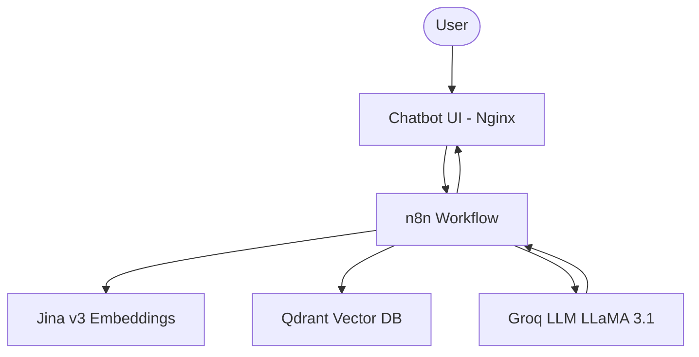

# 🎓 FSTM Chatbot — Portail Étudiant Intelligent

> **A RAG-powered chatbot for the Faculty of Sciences and Techniques of Mohammedia (FSTM).**

[](https://www.docker.com/)
[](https://n8n.io/)
[](https://qdrant.tech/)
[](https://jina.ai/)

**FSTM Chatbot** is a complete RAG (Retrieval-Augmented Generation) solution designed to assist students with academic procedures, schedules, and exam archives. It features automated scraping, high-dimensional vector search, and a modern web interface.

---

## 🏗️ Architecture



| Component | Technology | Role |
|-----------|------------|------|
| **Embeddings** | Jina v3 (768 dim) | High-accuracy vectorization |
| **Vector DB** | Qdrant | Fast semantic search |
| **LLM** | Groq (LLaMA 3.1 8B) | Natural language generation |
| **Orchestration** | n8n | RAG pipeline management |
| **Infra** | Docker Compose | Containerized deployment |

---

## 🚀 Getting Started

### 1. Prerequisites
- Docker & Docker Compose
- API Keys: Jina AI, Groq

### 2. Configuration
```bash
# Clone the repository
git clone https://github.com/iamsamahaziz/fstm-chatbot.git
cd fstm-chatbot

# Set up environment variables
cp .env.example .env
# Edit .env and add your JINA_API_KEY and GROQ_API_KEY
```

### 3. Deployment
```bash
# Start all services
docker compose up -d
```
| Service | URL |
|---------|-----|
| **Chatbot UI** | `http://localhost:3001` |
| **n8n Dashboard** | `http://localhost:5678` |
| **Qdrant API** | `http://localhost:6333` |

### 4. Data Indexing
```bash
# Install toolchain
pip install qdrant-client requests beautifulsoup4 pymupdf

# Run the scraping & indexing pipeline
python scrape_and_index.py
```

---

## 📂 Documentation & Features
- 🤖 **AI Support**: Instant answers about FSTM courses and procedures.
- 📄 **Exam Archives**: Direct PDF downloads for past papers.
- 👨‍🏫 **Staff Directory**: Detailed faculty information by department.
- 📅 **Schedules**: Real-time access to student timetables.

---
Created by **Samah AZIZ**
Faculty of Sciences and Techniques of Mohammedia (FSTM)
